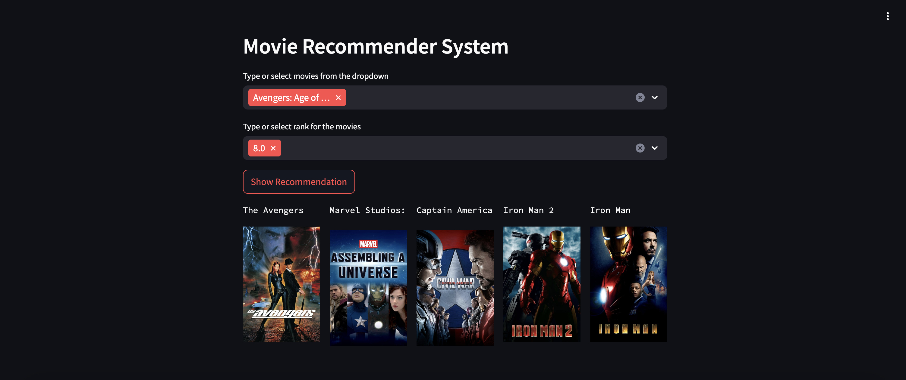
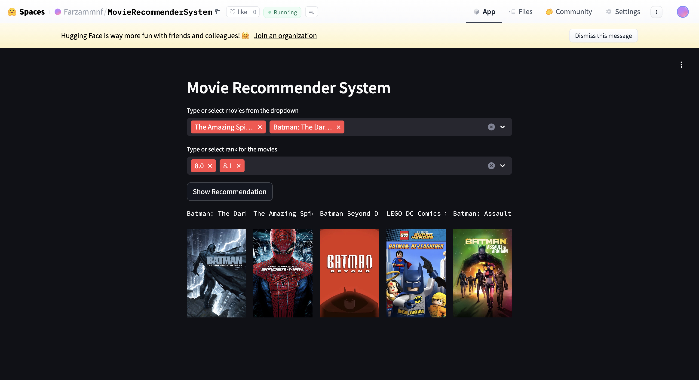
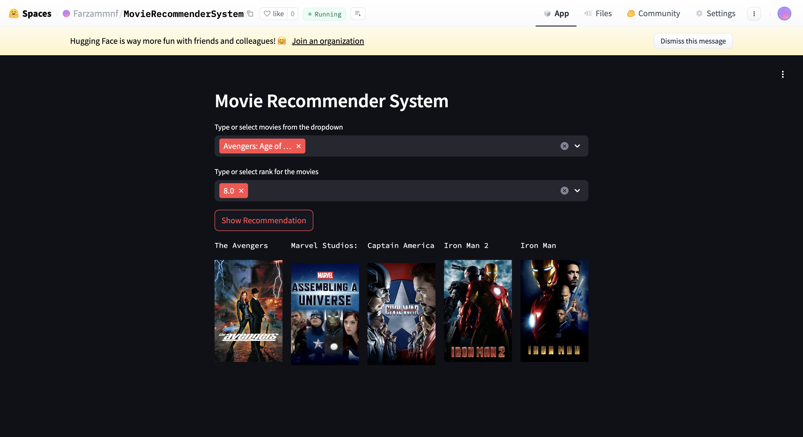

# MovieRecommenderSystem
A Content-Based Movie Recommender System that provides personalized movie recommendations based on movie similarity and user ratings.

## The Movies Dataset
The dataset used for this project can be found on Kaggle: [Movies Dataset](https://www.kaggle.com/datasets/rounakbanik/the-movies-dataset). It contains a wide range of movies and associated metadata.

## Contents

### Data Understanding and EDA
This analysis is completed in the **Data Preparation and EDA** notebook, where a cleaned version of the dataset is prepared for further use.

### Data Preprocessing
* **Handling Missing Values**: Identifying and addressing any missing or incomplete data.
* **Removing Duplicated Values**: Ensuring data integrity by eliminating duplicates.
* **Encoding with TF-IDF**: Transforming text data into numerical features using Term Frequency-Inverse Document Frequency (TF-IDF) encoding.

### Modeling
The recommendation model operates as follows:
1. **Similarity Matrix Calculation**: Uses cosine similarity to determine how similar movies are to each other.
2. **Top 5 Similar Movies**: For each movie, identifies the 5 most similar movies from the similarity matrix.
3. **Weighted Scores**: Multiplies the similarity scores of these movies by the original movie’s rating.
4. **Score Aggregation**: Repeats the above steps for all movies to generate a list of 15 movies with weighted scores.
5. **Recommendation**: Sorts the movies based on their weighted scores and provides the top 5 recommendations.

### Deployment
* **Streamlit App**: The recommender system is deployed as a Streamlit application, available on Hugging Face.

[Explore the model on Hugging Face](https://huggingface.co/spaces/Farzammnf/MovieRecommenderSystem)

---

### Sample
Here’s a preview of the application interface:

---

---

---
